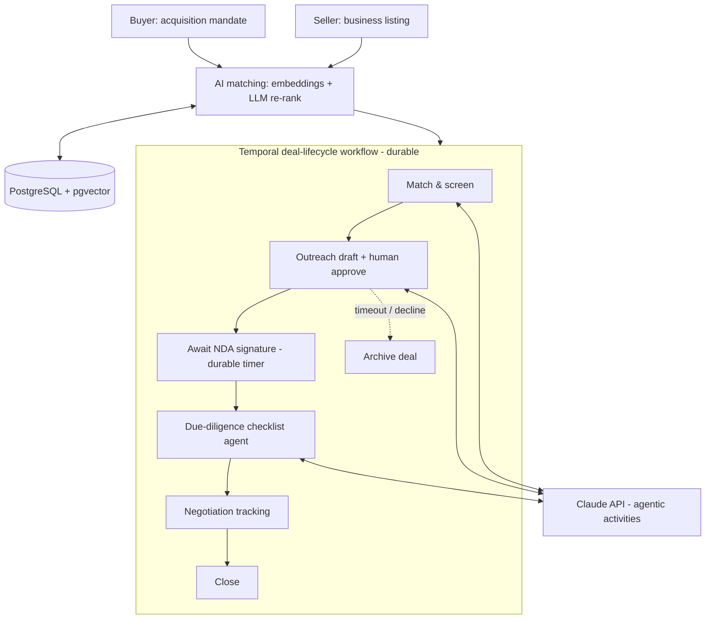

# Acquisitions Deal Platform

> Lower-middle-market M&A deals die in the gaps — the weeks between an intro and an NDA, the dropped follow-up during due diligence, the deal that silently stalls because no one owned the next step. **Acquisitions Deal Platform makes sure no deal stalls silently:** an AI layer finds and explains buyer↔seller matches, and every deal runs as a durable workflow that survives weeks-long waits, human approvals, and system crashes without losing its place.
>
> *Under the hood: Temporal for durable deal-lifecycle execution (sourcing → match → outreach → NDA → due diligence → negotiation → close), embeddings + LLM re-ranking for explainable matching.*

**For:** deal leads at boutique M&A advisories and search funds — it makes the advisor faster, it doesn't replace them.
**Skill signal:** AI agents / LLM orchestration · durable execution (Temporal) · semantic matching / ML · product engineering
**Region anchor:** SMB / lower-middle-market M&A across UK, EU, US, and Singapore

---

## Why this exists

An M&A deal is not a single matching query — it is a multi-stage process that runs for weeks, stalls on humans, and has steps that fail and need retrying or rolling back. That makes it a textbook case for **durable execution**: the orchestration must survive process crashes and resume exactly where it left off. The matching and screening layer on top is where **AI agents** earn their place — turning unstructured mandates and listings into ranked, explained matches and drafting the human-approved next action.

The two halves are deliberately distinct:

- **Durable orchestration** — the deal lifecycle as a Temporal workflow (retries, timers, human-in-the-loop signals, compensation).
- **AI matching & screening** — embeddings + LLM re-ranking and agentic activities running *inside* those workflows.

## Architecture

## Stack

- **Python** (FastAPI) — best fit for the AI/ML layer
- **Temporal** (Python SDK) — durable deal-lifecycle orchestration
- **PostgreSQL + pgvector** — structured profiles + embeddings for semantic matching
- **Claude API** — matching re-rank, outreach drafting, due-diligence agent (a smaller model for cheap steps, a larger one for reasoning-heavy steps)
- **Docker Compose** — Temporal server + workers + Postgres + API

## What makes it stand out

- **Durable agents** — the headline demo: **kill a worker mid-deal and the workflow resumes from its last completed step**; a declined outreach or an NDA timeout triggers graceful archival, not a stuck deal.
- **Concrete matching, not "AI magic"** — embeddings over structured mandates (sector, geography, revenue / EBITDA band) plus **LLM re-ranking against explicit criteria**, with a written rationale per match. A small **matching-quality eval** (precision@k over a labeled synthetic set) makes the quality measurable.
- **Human-in-the-loop as a first-class workflow concept** — approval gates and multi-week waits handled by Temporal signals and durable timers, not cron hacks. Agents *propose*; humans *approve* before anything external is sent.

See [`docs/product/brief.md`](./docs/product/brief.md) for the product thinking (users, success metrics, non-goals, risks), [`PLAN.md`](./PLAN.md) for the build plan, and [`docs/adr/`](./docs/adr/) for engineering decisions.

## Status

📋 Planning phase — specification and build plan committed. Implementation to follow.
